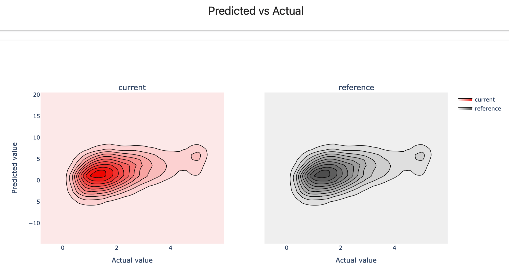
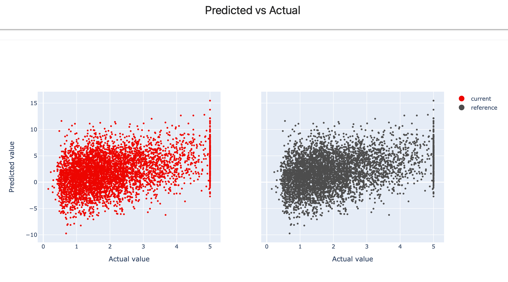


**You are looking at the old Evidently documentation**: this API is available with versions 0.6.7 or lower. Check the newer version [here](https://docs.evidentlyai.com/introduction).


**Pre-requisites**:
* You know how to generate Reports with default parameters.
* You know how to pass custom parameters for Reports or Metrics.

# Code example

You can refer to an example How-to-notebook:



# Default

Evidently Reports include visualizations, such as plotting values over time, which are aggregated by default. This keeps Reports size manageable, even with millions of evaluated rows.

For example, you can create a custom Report:

```python
report = Report(metrics=[
    RegressionPredictedVsActualScatter(),
    RegressionPredictedVsActualPlot()
])
report.run(reference_data=housing_ref, current_data=housing_cur)
report
```

Here is how the Scatter Plot in this Report will look:




**This does not affect Test Suites.** All visualizations in Test Suites are already aggregated.


# Non-aggregated plots for Reports 

If you prefer to see raw data plots (individual prediction points), you can enable this option. This will store raw data points inside the Report. 

To see non-aggregated plots, set the `raw_data` parameter as `True` in the render options.

You can set it on the Report level: 

```python
report = Report(
    metrics=[
      RegressionPredictedVsActualScatter(),
      RegressionPredictedVsActualPlot()
    ],
    options={"render": {"raw_data": True}}
  )
report.run(reference_data=housing_ref, current_data=housing_cur)
report
```

All plots in the Report will be non-aggregated. Here is how the Scatter Plot in this Report will look:




**Consider the data size.** We recommend setting this option for smaller datasets or when you apply sampling. With non-aggregated plots, the HTML will contain all the data on individual data points. For large datasets this will result in a very large Report and can make the plots unreadable. 



**Raw data is not available on Spark.** If you run the computations using Spark, the raw data option is not available.


# Non-aggregated plots for Metrics

If you want to generate non-aggregated plots only for some visualizations, you can pass the option to the chosen Metrics:

```python
report = Report(
    metrics=[
      RegressionPredictedVsActualScatter(options={"render": {"raw_data": True}}),
      RegressionPredictedVsActualPlot()
    ],
  )
report.run(reference_data=housing_ref, current_data=housing_cur)
report
```
