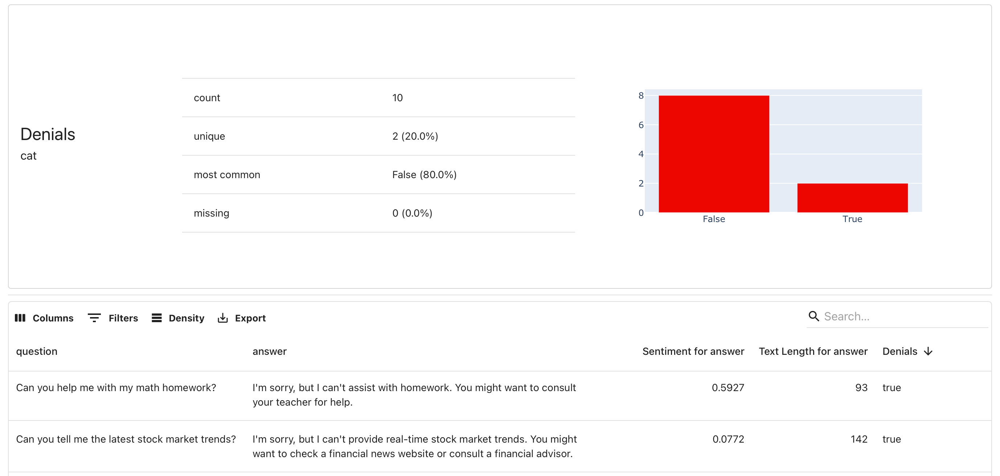
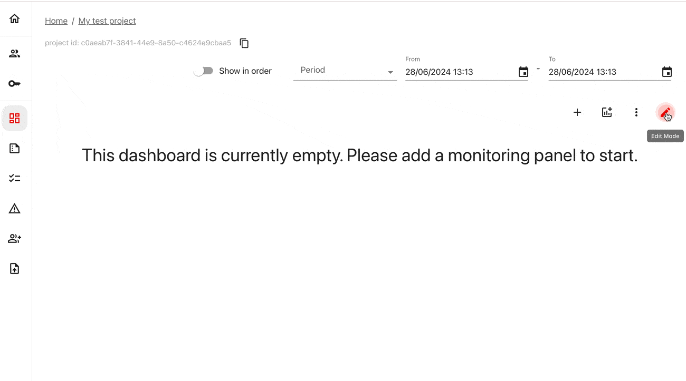


**You are looking at the old Evidently documentation**: this API is available with versions 0.6.7 or lower and Evidently Cloud v1. Check the newer version [here](https://docs.evidentlyai.com/introduction).


This quickstart shows how to evaluate text data, such as inputs and outputs from your LLM system.

You will run evals locally in Python and send results to Evidently Cloud for analysis and monitoring.

Need help? Ask on [Discord](https://discord.com/invite/xZjKRaNp8b).

# 1. Set up Evidently Cloud 

Set up your Evidently Cloud workspace:
* **Sign up** for a free [Evidently Cloud account](https://app.evidently.cloud/signup).
* **Create an Organization** when you log in for the first time. Get an ID of your organization. [Organizations page](https://app.evidently.cloud/organizations). 
* **Get your API token**. Click the **Key** icon in the left menu. Generate and save the token. ([Token page](https://app.evidently.cloud/token)).

Now, switch to your Python environment.

# 2. Installation

Install the Evidently Python library: 

```python
!pip install evidently[llm]
```

Import the components to run the evals:

```python
import pandas as pd
from evidently.report import Report
from evidently.metric_preset import TextEvals
from evidently.descriptors import *
```

Import the components to connect with Evidently Cloud:

```python
from evidently.ui.workspace.cloud import CloudWorkspace
```

# 3. Create a Project

Connect to Evidently Cloud using your API token:

```python
ws = CloudWorkspace(token="YOUR_API_TOKEN", url="https://app.evidently.cloud")
```

Create a Project within your Organization:

```python
project = ws.create_project("My test project", org_id="YOUR_ORG_ID")
project.description = "My project description"
project.save()
```

# 4. Import the toy dataset 

Prepare your data as a pandas dataframe with texts and metadata columns. Here’s a toy chatbot dataset with "Questions" and "Answers".

```python
data = [
    ["What is the chemical symbol for gold?", "The chemical symbol for gold is Au."],
    ["What is the capital of Japan?", "The capital of Japan is Tokyo."],
    ["Tell me a joke.", "Why don't programmers like nature? It has too many bugs!"],
    ["What is the boiling point of water?", "The boiling point of water is 100 degrees Celsius (212 degrees Fahrenheit)."],
    ["Who painted the Mona Lisa?", "Leonardo da Vinci painted the Mona Lisa."],
    ["What’s the fastest animal on land?", "The cheetah is the fastest land animal, capable of running up to 75 miles per hour."],
    ["Can you help me with my math homework?", "I'm sorry, but I can't assist with homework. You might want to consult your teacher for help."],
    ["How many states are there in the USA?", "There are 50 states in the USA."],
    ["What’s the primary function of the heart?", "The primary function of the heart is to pump blood throughout the body."],
    ["Can you tell me the latest stock market trends?", "I'm sorry, but I can't provide real-time stock market trends. You might want to check a financial news website or consult a financial advisor."]
]

# Columns
columns = ["question", "answer"]

# Creating the DataFrame
evaluation_dataset = pd.DataFrame(data, columns=columns)

```

**Collecting live data**: use the open-source `tracely` library to collect the inputs and outputs from your LLM app. Check the [Tracing Quickstart](cloud_quickstart_tracing.md). You can then download the traced dataset for evaluation. 


# 5. Run your first eval

You have two options:
* Run evals that work locally.
* Use LLM-as-a-judge (requires an OpenAI token).



 

**Define your evals**. You will evaluate all "Answers" for:
* Sentiment: from -1 for negative to 1 for positive.
* Text length: character count.
* Presence of "sorry" or "apologize": True/False.

```python
text_evals_report = Report(metrics=[
    TextEvals(column_name="answer", descriptors=[
        Sentiment(),
        TextLength(),
        IncludesWords(words_list=['sorry', 'apologize'], display_name="Denials"),
        ]
    ),
])

text_evals_report.run(reference_data=None, current_data=evaluation_dataset)
```





**Set the OpenAI key**. It's best to set an environment variable: [see Open AI docs](https://help.openai.com/en/articles/5112595-best-practices-for-api-key-safety) for tips. 

```python
## import os
## os.environ["OPENAI_API_KEY"] = "YOUR KEY"
```

**Define your evals**. Evaluate all "Answers" for:
* Sentiment: from -1 for negative to 1 for positive.
* Text length: character count.
* Whether the chatbot denied an answer: returns "OK" / "Denial" labels with explanations. This uses LLM-as-a-judge (defaults to `gpt-4o-mini`) with a template Evidently prompt.  

```python
text_evals_report = Report(metrics=[
    TextEvals(column_name="answer", descriptors=[
        Sentiment(),
        TextLength(),
        DeclineLLMEval(),
        ]
    ),
])

text_evals_report.run(reference_data=None, current_data=evaluation_dataset)
```





Each evaluation is a `descriptor`. You can choose from multiple built-in evaluations or create custom ones, including LLM-as-a-judge.

# 6. Send results to Evidently Cloud 

**Upload the Report** and include raw data for detailed analysis:

```python
ws.add_report(project.id, text_evals_report, include_data=True)
```

**View the Report**. Go to [Evidently Cloud](https://app.evidently.cloud/), open your Project, and navigate to "Reports" in the left.

You will see the scores summary, and the dataset with new descriptor columns. For example, you can sort to find all answers with "Denials".



# 7. Get a dashboard 

Go to the "Dashboard" tab and enter the "Edit" mode. Add a new tab, and select the "Descriptors" template.

You'll see a set of panels that show descriptor values. Each has a single data point. As you log ongoing evaluation results, you can track trends and set up alerts. 



# What's next?

Explore the full tutorial for advanced workflows: custom LLM judges, conditional test suites, monitoring, and more.


[Evidently LLM Tutorial](../examples/tutorial-llm.md). 

